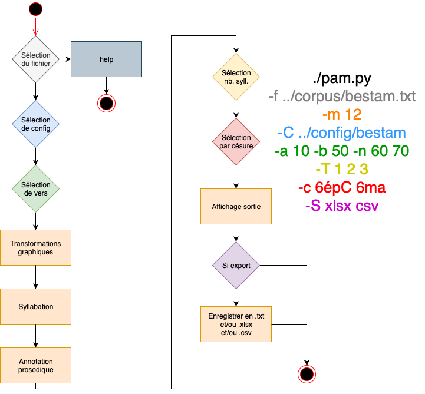
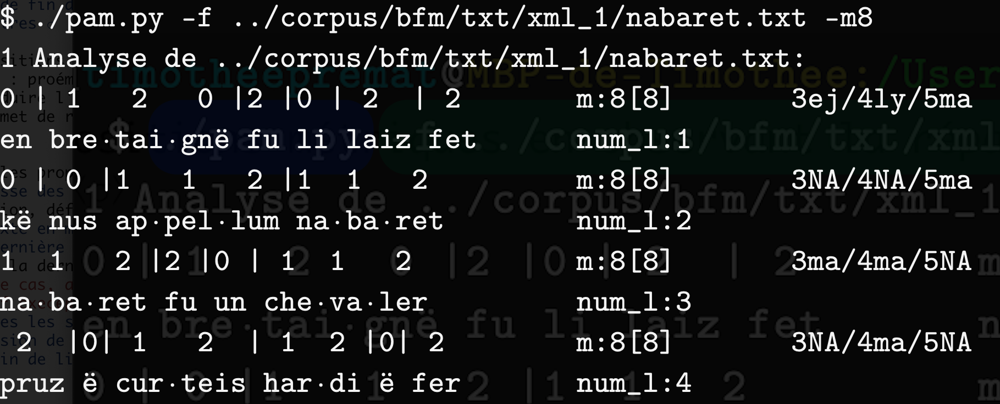

<!-- $theme: default -->
<!-- Enzo-->
# Le PAM, un Programme d'Annotation Métrique
### Enzo Poggio
Chercheur indépendant, diplômé en informatique pour Sciences Humaines
### Timothée Premat
Doctorant contractuel, Univ. Paris 8 : UMR 7023 (SFL)

---
<!-- Enzo -->
## Plan
- Introduction
  - Les corpus et la métrique
- Abrégé de théorie métrique et prosodique
- Le PAM : conception et fonctionnement
- Cas d'utilisation : localisation théorique des césures (ou pas)

&nbsp;

>Diaporama disponible pendant quelques temps sur :
>https://timotheepremat.wordpress.com

---
<!-- Tim -->
## Introduction : les corpus et la métrique

- La plupart des corpus sont développés par une équipe précise et pour un but précis
- Pour les langues mortes, il s'agit le plus souvent de mener des analyses :
  - lexicographiques (AND)
  - syntaxiques et/ou morphosyntaxiques + DD (BFM)
  - syntaxiques (SRCMF)
  - dialectologiques (Dees x2)
- Il ne s'agit le plus souvent pas d'analyser les modules 'bas' de la grammaire (ceux qui traitent des "formes sonores" : prosodie, métrique, phonologie et phonétique).
	- Dû à la distance entre formes graphiques et sonores ?
	- Dû à une conception du texte comme étant un objet écrit ?

---
- la TEI P5 propose pourtant des outils pour gérer ces modules 'bas' :
	- `feature structure` permet de gérer une structure de traits phonologiques
		- Mais son usage semble peu aisé
	- `seg element`permet de gérer les pieds
		- Mais la poésie médiévale française n'est pas une poésie à pieds (même si c'est parfois défendu pour les textes les plus anciens)
	- `caesura` peut marquer la césure
		- Utilisé dans un seul texte de la BFM (Fantosme)
	- `@met vs. @real`permettent de différencier structure métrique et structure prosodique
	- etc.

---
- Pourquoi ces outils ne sont pas utilisés ?
	- Parce que les éditeurs et/ou les corpus n'y voient pas d'intérêt ou priorisent d'autres types d'annotations
	- Parce qu'il n'existe pas d'outils permettant d'automatiser la tâche
- Or ces annotations sont précieuses pour le phonologue et le métricien
- Il faut donc produire un outil qui puisse procéder à cette annotation (ou à une annotation équivalente)
	- Le PAM : Programme d'Annotation Métrique
	- Il en existe d'autres :
		- Celui mis au point par T. Rainsford pour sa thèse (2011)
		- Celui mis au point par T. Rainsford avec C. Scrivner (2014)

---
## Théorie métrique et théorie prosodique
- Cadre : métrique générative
- Principe : associer les structures prosodiques d'énoncés donnés à celle d'un gabarit métrique donné (adopté depuis Kiparsky 1977)
	- Exemple : décasyllabe avec césure _a minori_ (4/6)
```
Gabarit métrique   x x  xX   	x   x  x   x  x  X
                   | |  ||   	|   |  |   |  |  |
Représentation     Σ σ  σΣ ⟨σ⟩	σ   σ  Σ   σ  σ  Σ ⟨σ⟩
 linguistique	  Bele Doette	as degres de la salle
```

Dans ce schéma :
- x = position non proéminente
- X = position proéminente
- σ = syllabe atone
- Σ = syllabe accentuable
- ⟨σ⟩ = syllabe flottante (-ə de rime féminine et césure épique)
---
```
Gabarit métrique   x x  xX   	x   x  x   x  x  X
                   | |  ||   	|   |  |   |  |  |
Représentation     Σ σ  σΣ ⟨σ⟩	σ   σ  Σ   σ  σ  Σ ⟨σ⟩
 linguistique	  Bele Doette	as degres de la salle
```
Règles d'associations :
1. Associer une syllabe à chaque position non proéminente
1. Associer une syllabe accentuable (Σ) à chaque position proéminente (X)
1. Ne tolérer de syllabes flottante (⟨σ⟩) qu'après une position proéminente (X) et en fin de mot.
- Mais elles se préoccupent pas des règles syntaxiques
	- p. ex. interdiction d'insérer une frontière métrique entre un adj. et son subst. support
	- certaines de ces règles peuvent être réécrites en termes prosodiques, mais certains pensent que toutes ne le peuvent pas.

---
### Conséquences pour la prosodie
- En associant les unités, on assure la cohésion des groupes indirectement (Σ et X marquent une fin de groupe)
- La métrique nous montre que les -e ne sont protégés de l'élision qu'en fin de groupe métrique
- Le groupe métrique correspond à un groupe prosodique possible


Donc, en plaçant les Σ et en déduisant les X, on doit pouvoir repérer automatiquement la structure métrique, la structure prosodique, et le domaine de l'élision du -ə.

---
### Objets et propriétés à annoter :
- En prosodie
	- Objet : la syllabe
	- Propriétés : proéminence (σ ou Σ)
		- et distinction entre :
			- σ de fin de mot placée après un Σ
				- syllabe posttonique
                - ⟨σ⟩ potentiel
			- autres σ

---
Comment annoter les propriétés syllabiques ?
- Définir la classe des mots non accentuables
	- Par déduction, définir la classe des mots accentuables
- Découper le texte en mots et syllabes
- Annoter Σ la dernière syllabe des mots accentuables
	- Sauf quand la dernière syllabe a un `<e>` pour noyau
		- Dans ce cas, annoter la pénultième Σ
		- Et sauf execeptions (adv. en -ent, etc.)
- Annoter σ toutes les syllabes non Σ
- Calculer l'élision de σ dans Σσ]<sub>w</sub> en fonction du mot suivant

On peut faire cela avec des listes d'exceptions (qu'on imprime à partir de textes déjà lemmatisés), pas d'une véritable lemmatisation de chaque texte.

---
<!-- Enzo-->
## Le PAM : conception et fonctionnement
### Présentation générale
- Script Python3
- Libairaires pour la tokénisation :
	- NLTK (_Natural Language ToolKit_) : pour les mots
	- Syllabise_py (syllabation française) : pour les syllabes

---



---
<!-- Tim-->
### Étiquettes du PAM
| PAM |        Prosodie       |  Exemple  | Équivalent métrique
|:---:|:---------------------:|:---------:|:---------------:|
|  -1 | -e élidé ou rime fém. |  chanpai**gne** / fei**re** | Ø
|  0  |           σ           | dë / a | x
|  1  |      σ prétonique     |  **ro**mans  | x
|  2  |           Σ           |  ro**mans**  | x ou X

```
  0 |  0| 0| 2  0| 0|  1   2  -1
puis quë ma da·më dë chan·pai·gne
  2  |  0| 1  2  |0| 2  -1|1    2   -1
vιalt quë ro·mans a fei·re an·prai·gne
  ```

---
<!-- Enzo-->
### Notation graphémique du PAM
  ```
    0 |  0| 0| 2  0| 0|  1   2  -1
puis quë ma da·më dë chan·pai·gne
    2  |  0| 1  2  |0| 2  -1|1    2   -1
vιalt quë ro·mans a fei·re an·prai·gne
  ```
Mise en place d'une notation 'syllabisante' avant l'étape de syllabation :
- ë : /ə/ final non élidé
- ι : /j/ non syllabique
- Et bien plus à découvrir en utilisant le PAM !

Puis position de la coupe syllabe interne : ・
<!-- Permet de gérer les diphtongues, les diérèses et synérèses, l'élision du schwa, etc.-->

---
### Output du PAM : verbose
<!-- Enzo-->


---


1. Commande d'appel du script
2. Chemin du fichier
3. Indication du mètre de référence
4. Texte et annotation prosodique
5. Nombre de syllabes métrifiées
6. Césures possibles

---
<!-- Tim-->
### Déduction de la structure métrique
- le PAM ne fait que de l'étiquetage prosodique
	- on ne peut pas étiqueter la structure métrique puisqu'elle est virtuelle
- c'est à l'utilisateur de déduire la structure métrique à partir des propriétés prosodiques récurrentes

---
```text
Analyse de ../corpus/clear_txt/Juise.txt

 1   2 |1  2 | 1   2 |  1  1 2 -1|0 | 1    2  -1    6ma
san·ιor o·ιez rai·son glo·rï·o·se et sain·tis·me
 0 | 2  |0 | 2 | 0| 2  | 0| 1  1  2 | 0| 2 -1 	    6ma
del cιel en est la voiz dë pa·ra·dis la vi·e
 0  | 0| 1   2  |0 | 2  0 | 0 |1  1   2  | 0 |2  -1 6épC
deus la tre·mist en ter·rë por a·men·deir noz vi·es
 0 | 0 | 2  0 | 1   2  |0| 2 |0 |0| 1   2 -1        6ma
kar tot su·mes tur·neit a dol et a mar·ty·re
 0  |1  2  | 1  1   2 |0 | 2   |0 |2 |  1  2 -1     6ma
nos  a·vons ca·ri·teit la foiz  en est fu·ï·e

1 ../corpus/clear_txt/Juise.txt	m:12
80.00% soit  4  /5 vers bien formés
20.00% soit  1  /5 vers mal formés
	- m:13[12]	20.00% soit  1  

Distribution des césures pour 5 vers:
	- [...]
	- 6ma	80.00% soit  4  
	- 6épC	20.00% soit  1  
	- [...]
```

---
<!-- Enzo-->
### Projet : Sortie XML
- réinjecter notre étiquetage dans les XML d'origine
- `parser-writer` de XML
- permettra aussi de rendre les informations syllabiques et prosodiques disponibles pour les requêtes, dans TXM par exemple
	- très intéressant pour les phonologues
- permettra, en croisant avec les informations syntaxiques, de préciser les groupes accentuels annotés

---
## Conclusion
- Les corpus de français médiéval n'annotent pas les propriétés 'sonores'
- Cela pousse les utilisateurs à développer leur propre outil
	- PAM : Programme d'Annotation Métrique
		- Découpage syllabique et annotations prosodiques
		- Permet la déduction de la structure métrique
- Projet en cours... `from __future_pam__ import *`


---
## Bibliographie
### Corpus (et recherches afférentes)
- AND = Anglo-Norman Dictionnary, http://www.anglo-norman.net
- BFM = Base de Français Médiéval de l'ENS de Lyon, dir. C. Guyot
- SRCMF = Syntactic Reference Corpus of Medieval French, dir. S. Prévost & A. Stein, http://srcmf.org/
- DEES, A., 1980. Atlas des formes et des constructions des chartes françaises du 13e siècle, Tübingen : M. Niemeyer Verlag
- — 1987. Atlas des formes linguistiques des textes littéraires de l'ancien français, Tübingen : M. Niemeyer Verlag
	- intégrés tous deux dans le NCA
- NCA = Nouveau Corpus d'Amsterdam, dir. P. Kunstmann & A. Stein, http://stella.atilf.fr/gsouvay/nca/
- TEI: P5 Guidelines, https://tei-c.org/guidelines/p5/

---
### Recherches
- Kiparsky, P., 1977. "The Rhythmic Structure of English Verse", in : _Linguistic inquiry_ 8.2
- Nespor, M. & I. Vogel, 2007 [1986]. _Prosodic Phonology_, Berlin : Mouton de Gruyter
- Rainsford, T., 2011. _The Emergence of Group Stress in Medieval French_, thèse de doct., University of Cambridge.
- — & O. Scrivner, 2014. "Metrical annotation for a verse treebank", in : _Proceedings of the Thirteenth International Workshop on Treebanks and Linguistic Theories (TLT13)_, éd. V. Heinrich _et al._, Tübingen, University of Tübingen.
